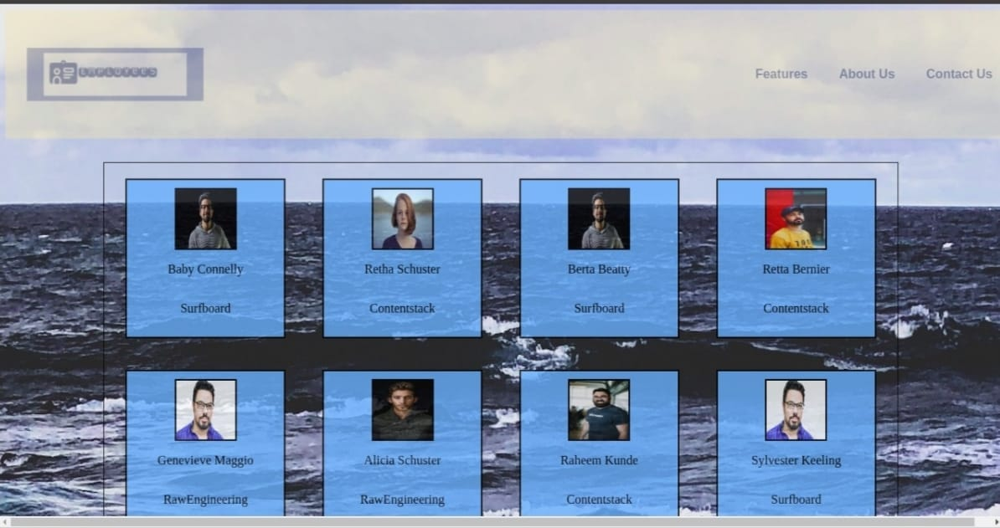

# Employee Card

**Employee Card** is a project in which we have have card of employees in our page the data is taken from json file using axios get
and cards are rendered  in our page

Content

- **index.html**-this files contain basic markup with javascript and css file linked to it.
- **style.css**-this files contain all the style for blog content navigation bar and hamburger and footer.
- **src**-this is javascript folder in which we have created modules and are imported in main.js which is linked to html page.
  
  **components**-this is javascript folder in which we have all the files which create employee card content to add in dom.

# DEMO: https://dishant45.github.io/Employee-card/index.html

